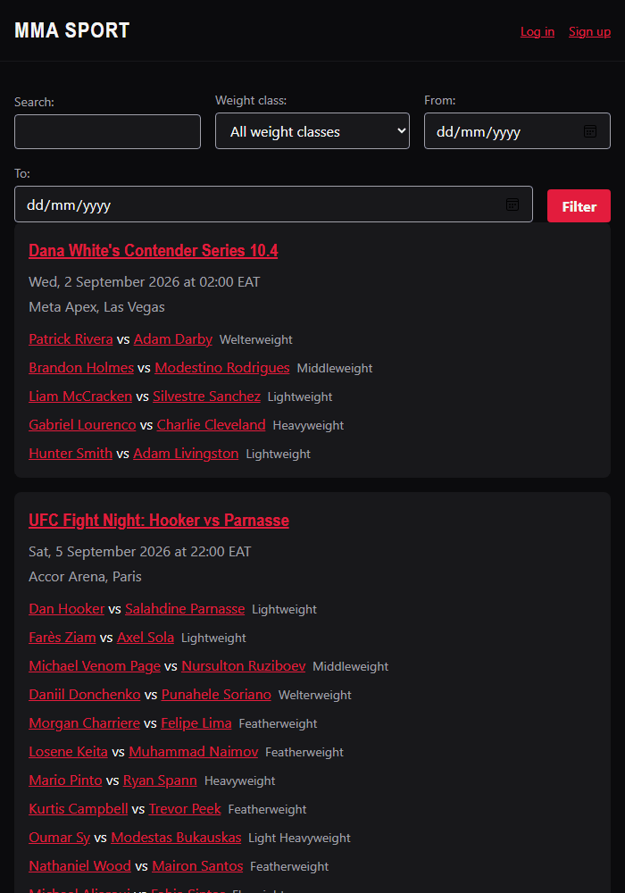

# MMA Sport

A customer-facing Django app for UFC/MMA fans: browse upcoming events,
drill into full fight cards, check fighter profiles, and (once logged in)
follow the events you care about. Data is synced from a third-party UFC
API ([mmaapi.dev](https://mmaapi.dev/)) into a local database rather than
fetched live on every page view.

Built end-to-end with **[Claude Code](https://claude.com/claude-code)**;
see [Built with Claude Code](#built-with-claude-code) below for how.



Repo: [github.com/henrymbuguak/claude-code-mma-sport](https://github.com/henrymbuguak/claude-code-mma-sport)

## Features

| Feature | What it does |
|---|---|
| Upcoming events list (`/`) | Browsable, filterable list of upcoming UFC events |
| Search & filter | Search by event/fighter name, filter by weight class or date range |
| Event detail (`/events/<slug>/`) | Full fight card grouped by segment (main card / prelims / early prelims), venue, poster |
| Fighter profiles (`/fighters/<slug>/`) | Record, nickname, country, photo, and upcoming bouts |
| Accounts (`/accounts/`) | Signup / login / logout: fully optional, browsing never requires an account |
| Follow / favorites (`/my-events/`) | Logged-in users can follow events and see them on a personal list |
| AI Match Intelligence | A short, neutral AI-generated analysis per bout: real fighter records and UFC rankings, no odds, no declared winner |

Everything is anonymous-friendly except following events, which requires
an account. There's no real-time notification delivery (email/push) yet;
that's an intentionally deferred, documented gap (see
[`CLAUDE.md`](CLAUDE.md)), not an oversight.

## Tech stack

- **Backend**: Python 3.12, Django 6.1, server-rendered templates (no
  separate frontend framework)
- **Database**: PostgreSQL (SQLite works fine for quick local setup)
- **Data source**: [mmaapi.dev](https://mmaapi.dev/), synced via a
  management command into local models (not called live per request)
- **AI**: [Anthropic API](https://docs.claude.com/) (`claude-opus-5`) via
  a real agentic tool-use loop (`client.beta.messages.tool_runner`),
  used only by one offline management command, never in the request path
- **Testing**: pytest + pytest-django, 79 tests
- **Formatting/linting**: Black, Ruff
- **Deploy target**: Heroku (`Procfile`, WhiteNoise for static files)

## Getting started

### Prerequisites

- Python 3.12
- PostgreSQL (optional for local dev; SQLite works too)
- A free [mmaapi.dev](https://mmaapi.dev/) API key, if you want to pull
  real event data (the app runs fine with an empty database otherwise)
- An [Anthropic API](https://console.anthropic.com/) key, only if you
  want to generate AI match analyses; everything else works without one

### Setup

```bash
git clone https://github.com/henrymbuguak/claude-code-mma-sport.git
cd claude-code-mma-sport

python -m venv .venv
source .venv/bin/activate          # Windows: .venv\Scripts\activate

pip install -r requirements-dev.txt
```

Copy the example environment file and fill it in:

```bash
cp .env.example .env
```

```ini
SECRET_KEY=                        # generate one, see below
DJANGO_DEBUG=True
ALLOWED_HOSTS=localhost,127.0.0.1
DATABASE_URL=postgres://localhost:5432/mma_sport   # or sqlite:///db.sqlite3 for a zero-setup local DB
MMAAPI_API_KEY=                    # your mmaapi.dev key (optional locally)
ANTHROPIC_API_KEY=                 # only needed for generate_match_intelligence
```

Generate a `SECRET_KEY`:

```bash
python -c "import secrets; print(secrets.token_urlsafe(50))"
```

Apply migrations and start the server:

```bash
python manage.py migrate
python manage.py runserver
```

Visit `http://127.0.0.1:8000/`. With an empty database you'll see the
site's empty state; to pull real events:

```bash
python manage.py sync_upcoming_events        # add --dry-run to preview first
python manage.py sync_rankings                # UFC divisional rankings, 1 API call
python manage.py generate_match_intelligence  # AI analysis per bout, needs ANTHROPIC_API_KEY
```

The sync commands are budget-aware: `sync_upcoming_events` stays well
within mmaapi.dev's free 500-calls/month tier by caching aggressively and
only refreshing bout data for events happening soon;
`generate_match_intelligence` caps itself to a small number of new
analyses per run (real dollar cost, not just an API rate limit). See
[`docs/data.md`](docs/data.md) for the exact numbers.

### Running tests

```bash
pytest              # full suite
black --check .     # formatting
ruff check .        # linting
```

## Project structure

```
mma_sport/      Django project package (settings, root urls)
events/         Event/Bout/Fighter/Ranking models, sync commands, list/detail/fighter/search views
accounts/       Signup, login, logout (Django's built-in User model)
favorites/      Follow/unfollow, "My Events": the only login-gated feature
intelligence/   AI match analysis: agentic Claude tool-use loop + generation command
templates/      Server-rendered templates, one subfolder per app
static/         CSS and JS
docs/           Detailed guidance referenced from CLAUDE.md (see below)
conftest.py     Shared pytest fixtures used across all apps' test suites
```

## Documentation

- [`CLAUDE.md`](CLAUDE.md): the project's living brief, scope, stack,
  decisions, and what's implemented vs. deliberately deferred
- [`docs/data.md`](docs/data.md): mmaapi.dev integration, caching
  strategy, timezone handling
- [`docs/design.md`](docs/design.md): visual identity, accessibility
  target
- [`docs/dev-practices.md`](docs/dev-practices.md): commands, testing
  conventions, app-by-app layout

## License

[MIT](LICENSE)

---

## Built with Claude Code

This project exists to demonstrate a real, working way to build software
with [Claude Code](https://claude.com/claude-code): not a single
one-shot prompt, but a repeatable process across seven shipped features,
including one that uses Claude itself as part of the product (an agentic
tool-use loop generating AI match analyses). Here's what that process
actually looked like.

### 1. Start with a `CLAUDE.md`, written conversationally

Before any code existed, Claude asked one question at a time: what the
product does, who it's for, the stack, the data source, visual identity,
accessibility target, and turned the answers into
[`CLAUDE.md`](CLAUDE.md): the file Claude reads at the start of every
session to know the project's scope and standing decisions. As the file
grew, detail was split out into [`docs/`](docs/) (data handling, design,
dev practices) so `CLAUDE.md` stays a short, scannable index rather than
a wall of text (a refactor done proactively when the file got long, not
prompted by a rule).

### 2. Plan before writing code: every feature, no exceptions

Every one of the seven features (upcoming list, event detail, fighter
profiles, accounts, follow/favorites, search/filter, AI match
intelligence) went through the same cycle:

1. **Explore** the existing code first, reusing established patterns
   (e.g. every view is a Django class-based generic view; every new
   feature area gets its own app) rather than reinventing them per
   feature.
2. **Plan Mode**: design the approach, including real trade-off calls:
   e.g. deciding the `Follow` model needed a `settings.AUTH_USER_MODEL`
   FK (not a hardcoded `User` import), that a new `favorites` app should
   own the join between `events` and `accounts` rather than bolting onto
   either, or (for the AI feature) stating plainly in the plan that a
   single pre-stuffed-context API call would've been simpler and cheaper
   than a real tool-use loop, and building the loop anyway because that
   was explicitly what was asked for.
3. **Write the plan as a User Story, Given/When/Then acceptance
   criteria, and an edge-case → state → resolution table**, not just a
   file list. This format was introduced after a mid-project check-in
   ("does our plan capture edge cases?") and adopted for every plan
   after that, including retrofitting the first one.
4. **Get explicit approval** before touching any file.
5. **Implement, test, verify**: run the automated test suite, run
   Black/Ruff, then actually drive the feature in a real browser
   (screenshots, keyboard-focus checks, mobile viewport) against real
   synced UFC data before calling it done.
6. **Update the docs**: `CLAUDE.md` and `docs/dev-practices.md` get a
   short update after every feature so they never drift from what's
   actually in the codebase.

### 3. Real debugging, not just code generation

Claude Code caught and fixed real bugs during this project, for example:
- The live API's field names (`startsAt`, `cardSection`, a `fighters[]`
  list) didn't match initial guesses from the API's landing page. Claude
  inspected the real payload, rewrote the parser defensively, and kept
  the existing tests passing by supporting both shapes.
- A "main event" heuristic that looked reasonable on paper turned out to
  tag *every* main-card fight as the main event, because a field named
  `cardSectionOrder` didn't mean what it sounded like. Caught by actually
  running the sync against live data and looking at the result, not by
  code review alone.
- `pytest`'s `testpaths` config silently swallowing an entire new app's
  test suite: caught once, then explicitly guarded against in every
  plan afterward.
- The UFC rankings endpoint's `page` parameter turned out to be silently
  ignored by the API: `page=1` and `page=2` returned byte-identical
  data. Caught by comparing two live responses side by side, not by
  assuming the endpoint worked like the (genuinely paginated) events
  endpoint. The sync was rewritten to one call with a generous `limit`
  instead of a wasteful, budget-burning pagination loop.
- A field the API sends as an explicit JSON `null` (fighter nickname)
  crashed a `NOT NULL` database constraint, because Python's
  `dict.get(key, "")` only falls back to the default when the key is
  *missing*, not when it's present with value `null`. Same bug class as
  the `testpaths` one: caught by actually running the command against
  live data, not by unit tests using clean fixtures.

### 4. The end result

- 7 features, each with its own reviewed plan and full test coverage
  (79 tests total)
- A `CLAUDE.md` + `docs/` set that documents *decisions and their
  reasoning*, not just what the code does
- A clean git history and a public repo: `git init`, a proper Python
  `.gitignore`, and GitHub repo creation, all driven the same way as the
  feature work

If you're evaluating Claude Code, the plan files, commit history, and
`CLAUDE.md`/`docs/` in this repo are the artifact: they show the actual
process, not just the output.
